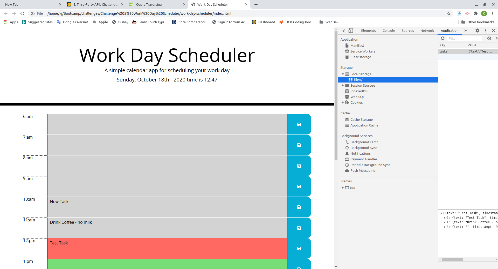

# Work Day Scheduler 

## Day scheduler
* Todays date is shown in the header
* A colorcoded schedule is shown for each hour of the present day day. 
   1. Past is grey
   1. Current hour is red 
   1. Furture hours is green.
* Tasks can beentered in the colored fields as text
* Individual tasks are saved by click in the area where the save icon is shown, the save icon grows and changes to black during hover
   * Only the task in the row is saved
* Tasks are saved in local storage ans will persist on page refresh

Here is a link: [https://kjwesthoff.github.io/work-day-scheduler/](https://kjwesthoff.github.io/work-day-scheduler/)

## Features
The most of the page i built using JavaScript and jQuery with miminmal html.

Tasks are saved in a list of JSON linearized objects, including a timestamp. The timestamp is used to avoid that duplicates are saved in the memory.   

Here is a screenshot:

